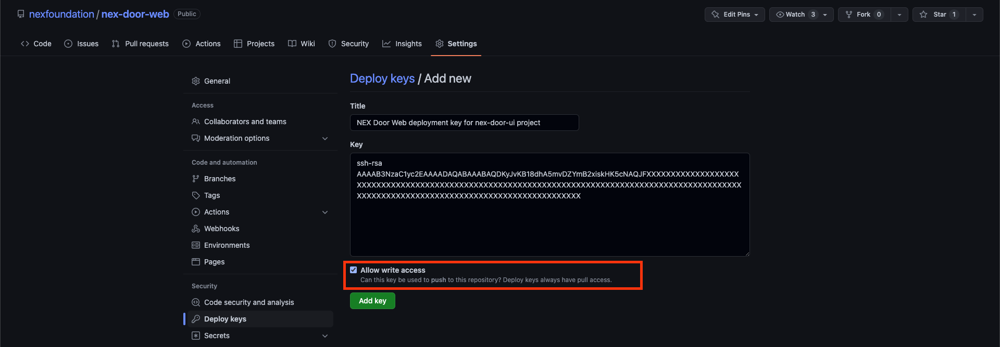

專案 GitHub action 自動化部署設置(archive)
---

這篇文件旨在說明目前 NEX Door UI 專案使用的自動化部署流程。

## 關鍵工作流程配置

以下說明均有關所有專案在推送到 `master` 分之後的部署必要設置，更多細節請參考 `.github/workflows/deploy.yml`。

### 1. 生成及配置 nex-door-web 專案部署對應的 SSH key

目前由於 `nex-door-ui` 仍為私有專案 (Private) 且尚未公開原始碼，因此會需要於流程中採用專案定義的 SSH 私鑰供推送到公開的 [nex-door-web](https://github.com/nexfoundation/nex-door) 專案並使用 GitHub Page 託管靜態內容。因此，若需要提供專案獨立的 SSH 鑰匙對供該專案使用 (非使用個人部署)，需定義目標部署專案 (nex-door-web) 使用：

(Linux/MacOS)
```
$ ssh-keygen
```

一旦具備 private & public key，請將 SSH 公鑰 (例如：`id_rsa.pub`) 設置於目標專案 (nex-door-web) 的 deploy keys 項目，請記得開啟寫入權限：



### 2. 定義 NEX Door UI 專案必要的部署配置 (Secret)

在專案中定義了幾項部署階段會使用到的環境設定，以下均使用 GitHub 提供專案獨立的 [Actions secrets](https://github.com/nexfoundation/nex-door-ui/settings/secrets/actions) 功能進行設置：

- `ACTIONS_STEP_DEBUG` (optional): 設定為 `true` 用於開啟 GitHub action 部署步驟對應的 Debug 紀錄，方便用於除錯 (參考 [GitHub Actions/Monitor & troubleshoot/Enabling debug logging](https://docs.github.com/en/actions/monitoring-and-troubleshooting-workflows/enabling-debug-logging#enabling-step-debug-logging))。
- `NEX_DOOR_WEB_DEPLOYMENT_SSH_KEY`: **請勿任意刪除**，已經事先使用 `ssh-keygen` 定義的 SSH 私鑰 (Private key) 供專案使用，用於推送到另一個公開的 [nex-door-web](https://github.com/nexfoundation/nex-door-web) (使用 GitHub Page 託管靜態內容)。這把私鑰對應已經在 [nex-door-web](https://github.com/nexfoundation/nex-door-web/settings/keys) 關聯的 SSH 公鑰 (Public key)。
- `NEX_DOOR_WEB_DEPLOYMENY_AWS_AMPLIFY_CONFIG_PROD`: **請勿任意刪除**，專案定義 Production 環境 API 及 Cognito 等相關的設定，用於部署時套用，格式參考專案 [`src/aws-exports.js.example`](https://github.com/nexfoundation/nex-door-ui/blob/master/src/aws-exports.js.example) 中所提供的範例。

註：目前由於 `nex-door-ui` 仍為私有專案 (Private) 且尚未公開原始碼，因此會需要於流程中採用專案定義的 SSH 私鑰供推送到公開的 [nex-door-web](https://github.com/nexfoundation/nex-door) 專案並使用 GitHub Page 託管靜態內容。若之後本專案 (nex-door-ui) 公開並開啟部署分支 (例如：`github-page`)，可以透過 GitHub 提供的 [Authentication token](https://docs.github.com/en/actions/security-guides/automatic-token-authentication) (`GITHUB_TOKEN`) 直接配置工作流程。

### 3. 環境變數

- `GH_PAGE_CNAME`：目前 GitHub page 部署對應的自定義域名
- `GIT_USER_NAME`：推送到目標專案 Git 使用的用戶名稱
- `GIT_USER_EMAIL`：推送到目標專案 Git 使用的用戶 Email (因為沒有專案或團隊專用的信箱，目前暫時使用 Project owner 的信箱)


